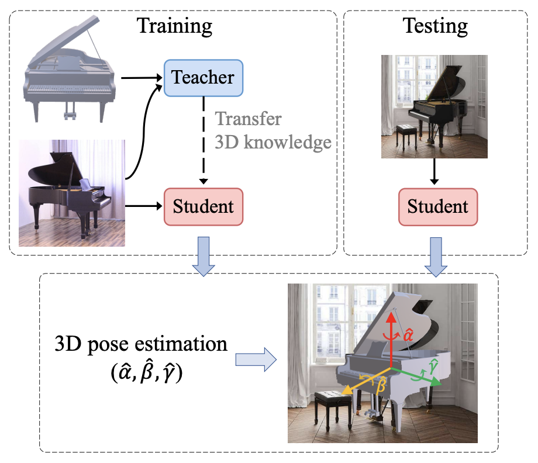

# 3DAug-Pose

[ICMR 2022 Full Paper] Pytorch implementation of [**3D-Augmented Contrastive Knowledge Distillation for
Image-based Object Pose Estimation**](https://dl.acm.org/doi/10.1145/3512527.3531359) paper. 

Check out our [**Paper**](https://arxiv.org/pdf/2206.02531.pdf) for more details.



```
@INPROCEEDINGS{Liu3DAugPose,
    author = {Zhidan Liu, Zhen Xing, Xiangdong Zhou, Yijiang Chen, and Guichun Zhou},
    title = {3D-Augmented Contrastive Knowledge Distillation for Image-Based Object Pose Estimation},
    year = {2022},
    booktitle = {Proceedings of the 2022 International Conference on Multimedia Retrieval},
    pages = {508–517} 
}
```


## Installation

### 1. Create conda environment

```
conda create -n pose_estimation
conda activate pose_estimation
conda install --yes --file requirements.txt
```

PyTorch 1.8.0 + CUDA 11.1

### 2. Download datasets

Download following datasets if you need:
- `ObjectNet3D`
  ([link](https://cvgl.stanford.edu/projects/objectnet3d/) to the original dataset page. 
  ImageNet images picturing 100 rigid object classes.)
- `Pascal3D+` 
  ([link](https://cvgl.stanford.edu/projects/pascal3d.html) to the original dataset page. 
  ImageNet and PascalVOC images picturing 12 rigid object classes in the wild)
- `Pix3D` 
  ([link](http://pix3d.csail.mit.edu) to the original dataset page. 
  Mixed-sources images picturing 9 rigid object classes including "tools" and "misc".)

**Note:** Pix3D is only used for evaluation, while Pascal3D+ and ObjectNet3D both contain _train/val_ split for training and testing.


## How to use

### 1. Launch a training

This work is based on the **two-stage training process**, so it is noted that the teacher model is first trained, and then we freeze the pre-trained teacher model and train the student model in a teacher-student model structure.

We also implemented the few-shot (or zero-shot) setting in the program.

Follow these commands to train the models:

- Train the teacher model based on PointCloud and RGB images
```
python training.py --dataset ObjectNet3D --n_epoch 300 --lr 1e-4 --decrease 200 --random --shape PointCloud --shape_dir pointcloud --shape_feature_dim 1024 --batch_size 160 --img_feature_dim 1024

python training.py --dataset Pascal3D --n_epoch 300 --lr 1e-4 --decrease 200 --random --shape PointCloud --shape_dir pointcloud --shape_feature_dim 1024 --batch_size 160 --img_feature_dim 1024

# few-shot setting
python training.py --dataset ObjectNet3D --n_epoch 90 --lr 1e-4 --decrease 30 --random --shape PointCloud --shape_dir pointcloud --shape_feature_dim 1024 --batch_size 160 --img_feature_dim 1024 --model result/PointCloud_ObjectNet3D_novel/deformNet_new/model_best.pth --shot 10
```

- Train the student model guided by the pre-trained teacher model only based on RGB images
```
# manually set the batch size in the code
python trainingKD.py --dataset ObjectNet3D --lr 1e-4 --decrease 44 --batch_size 46 --shape PointCloud --shape_dir pointcloud --teacher_model result/PointCloud_ObjectNet3D/deformNet_new/model_best.pth --crd --tau=0.5 --weighting linear

python trainingKD.py --dataset Pascal3D --lr 1e-4 --decrease 44 --batch_size 46 --shape PointCloud --shape_dir pointcloud --teacher_model result/PointCloud_Pascal3D/DeformNet_new/model_best.pth --crd --tau=0.5 --weighting linear
```

### 2. Evaluate on different datasets

-  Evaluate the teacher model on PointCloud and RGB images
```
python testing.py --dataset ObjectNet3D --shape PointCloud --shape_dir pointcloud
 --model result/PointCloud_ObjectNet3D/model_best.pth --output_dir ObjectNet3D --img_feature_dim 1024

python testing.py --dataset Pascal3D --shape PointCloud --shape_dir pointcloud --model result/PointCloud_Pascal3D/model_best.pth --output_dir Pascal3D --img_feature_dim 1024
```

- Evaluate the student model on RGB images
```
python testing.py --dataset ObjectNet3D --shape None --model save_models/best_student.pt --output_dir ObjectNet3D --img_feature_dim 2048
```

### 3. Visualization (optional)

Check `vis_tSNE.py` that uses PCA and tSNE methods to generate a figure of scatter points, visualizing sample representations for further analysis.


